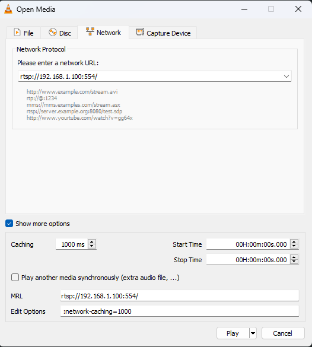
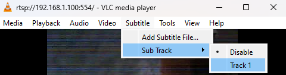
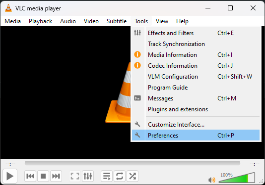
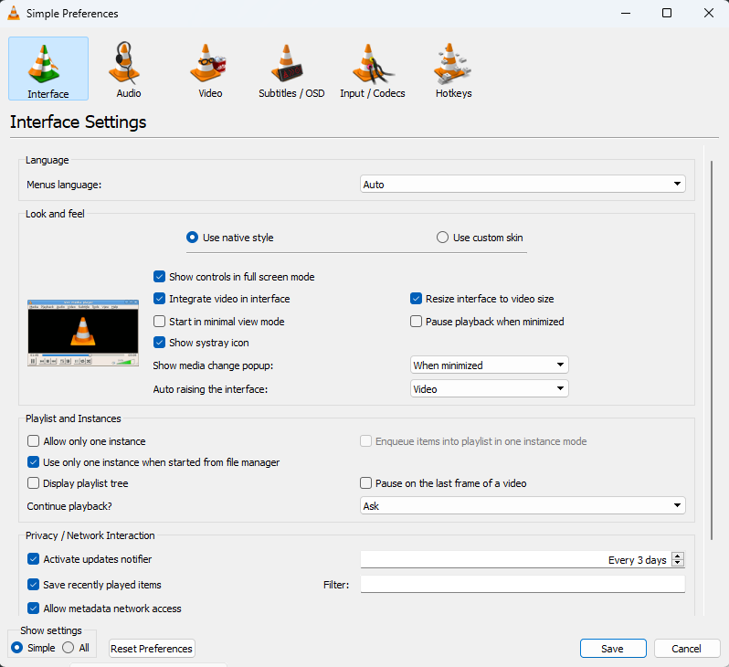
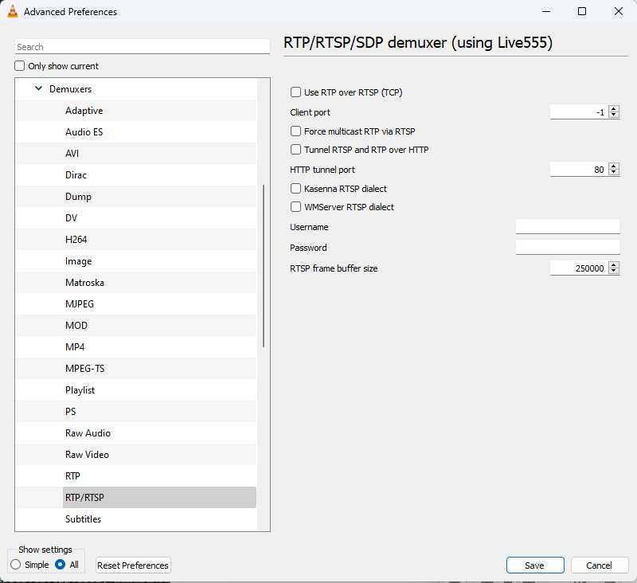

# ESP32-RTSPServer

[](https://github.com/rjsachse/ESP32-RTSPServer/releases)
[](https://github.com/rjsachse/ESP32-RTSPServer/issues)
[](https://github.com/rjsachse/ESP32-RTSPServer/blob/master/LICENSE)


## Support This Project

If this library has been useful to you, please consider donating or sponsoring to support its development and maintenance. Your contributions help ensure that this project continues to improve and stay up-to-date, and also support future projects.

[](https://github.com/sponsors/rjsachse)

Thank you for your support!

## Overview
This is my first library I have created. RTSPServer Library is for the ESP32, designed to stream video, audio, and subtitles. This library allows you to easily create an RTSP server for streaming multimedia content using an ESP32. It supports various transport types and integrates with the ESP32 camera and I2S audio interfaces.

## Features
- **Multiple Clients**: Multiple clients for multicast or for all transports with a define override
- **Video Streaming**: Stream video from the ESP32 camera.
- **Audio Streaming**: Stream audio using I2S.
- **Subtitles**: Stream subtitles alongside video and audio.
- **Transport Types**: Supports multiple transport types, including video-only, audio-only, and combined streams.
- **Protocols**: Stream multicast, unicast UDP & TCP (TCP is Slower).

## Test Results with OV2460

| Resolution | Frame Rate |
|------------|------------|
| QQVGA      | 50 Fps     |
| QCIF       | 50 Fps     |
| HQVGA      | 50 Fps     |
| 240X240    | 50 Fps     |
| QVGA       | 50 Fps     |
| CIF        | 50 Fps     |
| HVGA       | 50 Fps     |
| VGA        | 25 Fps     |
| SVGA       | 25 Fps     |
| XGA        | 12.5 Fps   |
| HD         | 12.5 Fps   |
| SXGA       | 12.5 Fps   |
| UXGA       | 5 Fps      |

## Prerequisites
This library requires the ESP32 core by Espressif. Ensure you have at least version 3.0.7 installed.

### Installing the ESP32 Core by Espressif
1. Open the Arduino IDE.
2. Go to `File` -> `Preferences`.
3. In the "Additional Board Manager URLs" field, add the following URL: `https://raw.githubusercontent.com/espressif/arduino-esp32/gh-pages/package_esp32_index.json`
4. Click `OK` to close the Preferences window.
5. Go to `Tools` -> `Board` -> `Boards Manager`.
6. Search for `esp32` and install the latest version by Espressif.

## Installation
1. **Manual Installation**:
   - Download the library from [GitHub](https://github.com/rjsachse/ESP32-RTSPServer).
   - Unzip the downloaded file.
   - Move the `ESP32-RTSPServer` folder to your Arduino libraries directory (usually `Documents/Arduino/libraries`).

2. **Library Manager**:
   - Open the Arduino IDE.
   - Search for ESP32-RTSPServer
   - or
   - Go to `Sketch` -> `Include Library` -> `Add .ZIP Library...`.
   - Select the downloaded `ESP32-RTSPServer.zip` file.

## Usage
### Include the Library
Basic Setup
```cpp

#include <ESP32-RTSPServer.h>

// Include all other libraries and setups eg Camera, Audio

// RTSPServer instance
RTSPServer rtspServer;

// Creates a new task so the main camera task can continue
//#define RTSP_VIDEO_NONBLOCK // uncomment if already have a camera task.


// Task handles
TaskHandle_t videoTaskHandle = NULL; 
TaskHandle_t audioTaskHandle = NULL; 
TaskHandle_t subtitlesTaskHandle = NULL;

void getFrameQuality() { 
  sensor_t * s = esp_camera_sensor_get(); 
  quality = s->status.quality; 
  Serial.printf("Camera Quality is: %d\n", quality);
}

void sendVideo(void* pvParameters) { 
  while (true) { 
    // Send frame via RTP
    if(rtspServer.readyToSendFrame()) { // Must use
      camera_fb_t* fb = esp_camera_fb_get();
      rtspServer.sendRTSPFrame(fb->buf, fb->len, quality, fb->width, fb->height);
      esp_camera_fb_return(fb);
    }
    vTaskDelay(pdMS_TO_TICKS(1)); 
  }
}

void sendAudio(void* pvParameters) { 
  while (true) { 
    size_t bytesRead = 0;
    if(rtspServer.readyToSendAudio()) {
      bytesRead = micInput();
      if (bytesRead) rtspServer.sendRTSPAudio(sampleBuffer, bytesRead);
      else Serial.println("No audio Recieved");
    }
    vTaskDelay(pdMS_TO_TICKS(1)); // Delay for 1 second 
  }
}

void sendSubtitles(void* pvParameters) {
  char data[100];
  while (true) {
    if(rtspServer.readyToSendAudio()) {
      size_t len = snprintf(data, sizeof(data), "FPS: %lu", rtspServer.rtpFps);
      rtspServer.sendRTSPSubtitles(data, len);
    }
  vTaskDelay(1000 / portTICK_PERIOD_MS); // Delay for 1 second has to be 1 second
  }
}

void setup() {

  getFrameQuality(); //Retrieve frame quality

  // Create tasks for sending video, and subtitles
  xTaskCreate(sendVideo, "Video", 3584, NULL, 1, &videoTaskHandle);
  xTaskCreate(sendAudio, "Audio", 2560, NULL, 1, &audioTaskHandle);
  xTaskCreate(sendSubtitles, "Subtitles", 2048, NULL, 1, &subtitlesTaskHandle);

  // Initialize the RTSP server
   //Example Setup usage:
   // Option 1: Start RTSP server with default values
   if (rtspServer.begin()) { 
   Serial.println("RTSP server started successfully on port 554"); 
   } else { 
   Serial.println("Failed to start RTSP server"); 
   }
   
   // Option 2: Set variables directly and then call begin
   rtspServer.transport = RTSPServer::VIDEO_AUDIO_SUBTITLES; 
   rtspServer.sampleRate = 48000; 
   rtspServer.rtspPort = 8554; 
   rtspServer.rtpIp = IPAddress(239, 255, 0, 1); 
   rtspServer.rtpTTL = 64; 
   rtspServer.rtpVideoPort = 5004; 
   rtspServer.rtpAudioPort = 5006; 
   rtspServer.rtpSubtitlesPort = 5008;
   if (rtspServer.begin()) { 
   Serial.println("RTSP server started successfully"); 
   } else { 
   Serial.println("Failed to start RTSP server"); 
   }
   
   // Option 3: Set variables in the begin call
   if (rtspServer.begin(RTSPServer::VIDEO_AUDIO_SUBTITLES, 554, sampleRate)) { 
   Serial.println("RTSP server started successfully"); 
   } else { 
   Serial.println("Failed to start RTSP server"); 
   }
}

void loop() {

}
   
```
## VLC Settings
To change the delay open "Show more options" and change the "Caching"



To turn on subtitles make sure "Track 1" is enables



Change RTSP settings



Click "Show settings All" bottom left



On the left open "Input / Codecs" then "Demuxes" then "RTP/RTSP" to enable TCP or Multicast



## Optional Defines

You can customize the behavior of the RTSPServer library by defining the following macros in your sketch:

- **OVERRIDE_RTSP_SINGLE_CLIENT_MODE**
  - Description: Override the default behavior of allowing only one client for unicast or TCP.

- **RTSP_VIDEO_NONBLOCK**
  - Description: Enable non-blocking video streaming. Creates a separate task for video streaming so it does not block the main sketch video task.

- **RTSP_LOGGING_ENABLED**
  - Description: Enable logging for debugging purposes. This will save 7.7KB of flash memory if disabled.

## API Reference

### Class: RTSPServer

#### Methods

- **RTSPServer()**
  - Description: Constructor for the RTSPServer class.

- **~RTSPServer()**
  - Description: Destructor for the RTSPServer class.

- **bool init(TransportType transport = NONE, uint16_t rtspPort = 0, uint32_t sampleRate = 0, uint16_t port1 = 0, uint16_t port2 = 0, uint16_t port3 = 0, IPAddress rtpIp = IPAddress(), uint8_t rtpTTL = 255)**
  - Description: Initializes the RTSP server with specified settings.
  - Parameters:
    - `transport` (TransportType): Type of transport (default is NONE).
    - `rtspPort` (uint16_t): Port number for the RTSP server (default is 0).
    - `sampleRate` (uint32_t): Sample rate for audio streaming (default is 0).
    - `port1` (uint16_t): Port number for video (default is 0).
    - `port2` (uint16_t): Port number for audio (default is 0).
    - `port3` (uint16_t): Port number for subtitles (default is 0).
    - `rtpIp` (IPAddress): IP address for RTP (default is IPAddress()).
    - `rtpTTL` (uint8_t): TTL for RTP (default is 255).
  - Returns: `bool` - `true` if the server initialized successfully, `false` otherwise.

- **void deinit()**
  - Description: Deinitializes the RTSP server.

- **bool reinit()**
  - Description: Reinitializes the RTSP server.
  - Returns: `bool` - `true` if the server reinitialized successfully, `false` otherwise.

- **void sendRTSPFrame(const uint8_t* data, size_t len, int quality, int width, int height)**
  - Description: Sends a video frame via RTP.
  - Parameters:
    - `data` (const uint8_t*): Pointer to the frame data.
    - `len` (size_t): Length of the frame data.
    - `quality` (int): Quality of the frame.
    - `width` (int): Width of the frame.
    - `height` (int): Height of the frame.

- **void sendRTSPAudio(int16_t* data, size_t len)**
  - Description: Sends audio data via RTP.
  - Parameters:
    - `data` (int16_t*): Pointer to the audio data.
    - `len` (size_t): Length of the audio data.

- **void sendRTSPSubtitles(char* data, size_t len)**
  - Description: Sends subtitle data via RTP.
  - Parameters:
    - `data` (char*): Pointer to the subtitle data.
    - `len` (size_t): Length of the subtitle data.

- **void startSubtitlesTimer(esp_timer_cb_t userCallback)**
  - Description: Starts a timer for sending subtitles.
  - Parameters:
    - `userCallback` (esp_timer_cb_t): Callback function to be called by the timer.

- **bool readyToSendFrame() const**
  - Description: Checks if the server is ready to send a video frame.
  - Returns: `bool` - `true` if ready, `false` otherwise.

- **bool readyToSendAudio() const**
  - Description: Checks if the server is ready to send audio data.
  - Returns: `bool` - `true` if ready, `false` otherwise.

- **bool readyToSendSubtitles() const**
  - Description: Checks if the server is ready to send subtitle data.
  - Returns: `bool` - `true` if ready, `false` otherwise.

#### Variables

- **uint32_t rtpFps**
  - Description: Read FPS.

- **TransportType transport**
  - Description: Type of transport.

- **uint32_t sampleRate**
  - Description: Sample rate for audio streaming.

- **int rtspPort**
  - Description: Port number for the RTSP server.

- **IPAddress rtpIp**
  - Description: Multicast address.

- **uint8_t rtpTTL**
  - Description: TTL for RTP.

- **uint16_t rtpVideoPort**
  - Description: Port number for video.

- **uint16_t rtpAudioPort**
  - Description: Port number for audio.

- **uint16_t rtpSubtitlesPort**
  - Description: Port number for subtitles.

- **uint8_t maxRTSPClients**
  - Description: Maximum number of RTSP clients.

## Support This Project

If this library has been useful to you, please consider donating or sponsoring to support its development and maintenance. Your contributions help ensure that this project continues to improve and stay up-to-date, and also support future projects.

[](https://github.com/sponsors/rjsachse) 

Thank you for your support!
